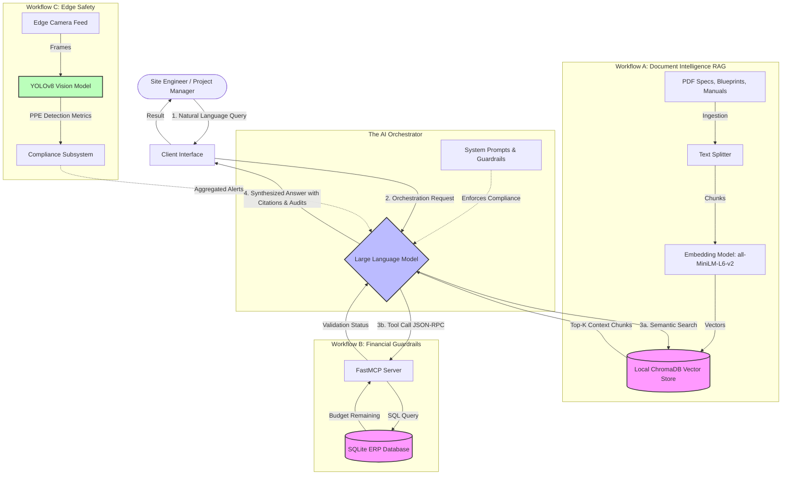

# EnterpriseAI: Technical Architecture Diagram

This document illustrates the data flow and technology stack powering the EnterpriseAI infrastructure. The architecture is designed to keep proprietary data localized while leveraging advanced language models for orchestration and reasoning.

## Full System Data Flow

The following diagram uses Mermaid syntax (supported natively by GitHub) to visualize how the three core workflows interact with the centralized AI Orchestrator.

## Component Breakdown

1. **The AI Orchestrator (The Brain):** The Large Language Model acts as the reasoning engine. It does not store factual data in its weights; instead, it is restricted by strict system prompts (the "Penthouse Rules") to only answer based on the context provided to it.
2. **Retrieval-Augmented Generation (RAG):** When asked about specifications, the Orchestrator queries the local ChromaDB. The mathematical embedding model runs entirely on local CPUs, ensuring that massive, proprietary PDF blueprints never leave the secure network.
3. **Model Context Protocol (MCP):** When asked to approve financial invoices, the Orchestrator cannot guess. It utilizes MCP to execute a secure, predefined tool call that queries the ERP database. This enforces "least privilege" access, allowing the AI to read the budget without giving it direct SQL write access.
4. **Edge AI Monitoring:** Computer vision runs on localized hardware near the cameras. Instead of streaming gigabytes of video to the cloud for analysis, the YOLO model processes frames on the edge and only sends lightweight text alerts (e.g., "Hardhat violation detected") back to the central system.
